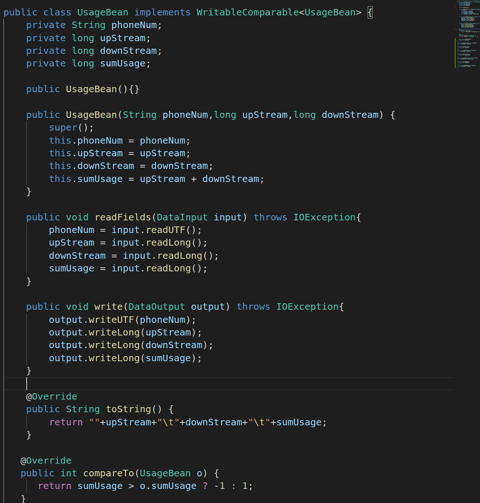

# Assignment 1 - Mapreduce
### Requirement

1. Aggreate the upload ,download and total data usage for each handphone number
 
2. Sort the result by total data usage in descending order

### input file 

### Code development
#### 1. UsageBean  : Bean to store the usage data

##### It has overriden the compareTO function for sorting purpose. (Sort according to total usage in descending order)

#### 2. UsageMapper : to parse the input file. 

##### It extracts the phone number, upload and download data for every line in the input file and creates an UsageBean instance to hold the data.
##### It then set the phone number as key and put the UsageBean instance as value and pass to UsageReducer

#### 3. UsageReducer : to do the data aggregation. 

##### It receives the output of UsageMapper as input.It then aggreates the upload and download data if they are from same handphone number. The summation of upload and download data is performed in UsageBean itself.

#### 4. UsageSorter : to perform sorting. 

##### It receives the output of UsageReducer as input. It has 2 inner classes:
##### <ul>
##### <li><b>SortUsageMapper</b>: It parses the the output of UsageReducer and extracts out the phone number, upload and download data. It then creates a UsageBean to hold data and uses it as key. This will enable sorting before the data is passed to SortUsageReducer.</li>
##### <li><b>SortUsageReducer</b>: It receives the results of sorting. It then extract out the phone number, set it as key and UsageBean as value. This will generate the output as <Phone number>   <Total Upload data>    <Total Download data>    <Total Upload+Download data></li></ul>

#### 5. UsageRunner : Create Job to perform tasks

##### It creates 2 jobs:
##### <ol><li> Job1 : Aggregate the usage data (UsageMapper and UsageReducer) </li>
##### <li> Job2 : Sort the result (SortUsageMapper and SortUsageReducer) </li></ol>
##### They are executed one after another, Job1 follows by Job2.

### Execution in Yarn

#### 1. Upload the input file
>bin/hdfs dfs -put /home/yenyen/workspace/java-wp/hadoop/demo/wordcount1/src/input/HTTP_20130313143750.dat /user/yen/input

#### 2. Execute UsageRunner
>bin/hadoop jar /home/yenyen/workspace/java-wp/hadoop/assignments/assignment1/target/usagecalculator-1.0.jar lesson.bigdata.UsageRunner /user/yen/input /user/yen/output1 /user/yen/output2

#### 3. Output

##### Output for Job1 (Aggregation)

##### Output for Job2 (Sorting)

